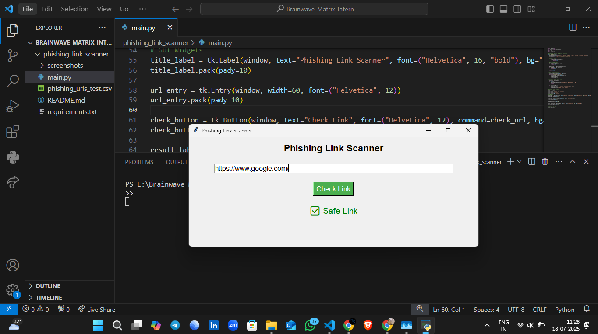
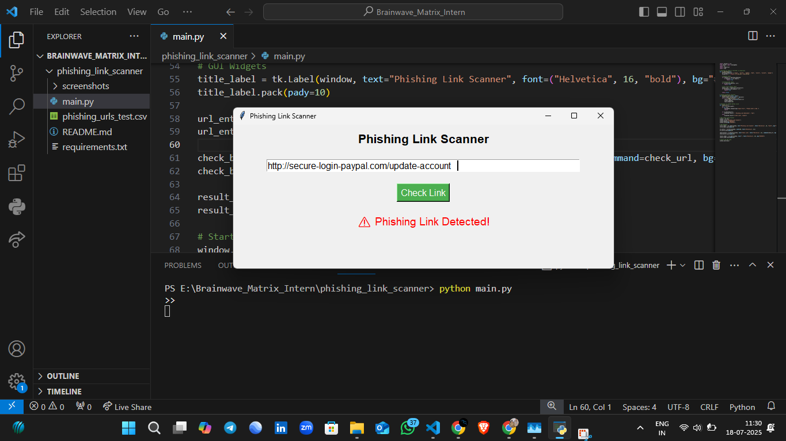

# 🔐 Phishing Link Scanner using Python GUI

**Cyber Security Internship – Task 1**  
🗓️ Completed on: 18 July 2025  
👨‍💻 Created by: **Hareesh Kumar**

---

## 🧠 Project Overview

This is a **Phishing Link Scanner** tool developed using **Python and Tkinter GUI**, as part of Task 1 in the Cyber Security Internship at **Brainwave Matrix Solutions**.

<p align="center">
  
</p>

<p align="center">
  
</p>


It scans URLs and detects whether they are suspicious using:

- ✅ Phishing keyword matching
- ✅ IP-based URL detection
- ✅ Short domain checks
- ✅ Animated feedback in GUI

---

## 💻 Tech Stack

- Python 3
- Tkinter (GUI)
- Regex (`re`)
- tldextract

---

## 🚀 How to Run

1. Install required package:
```bash
pip install tldextract
